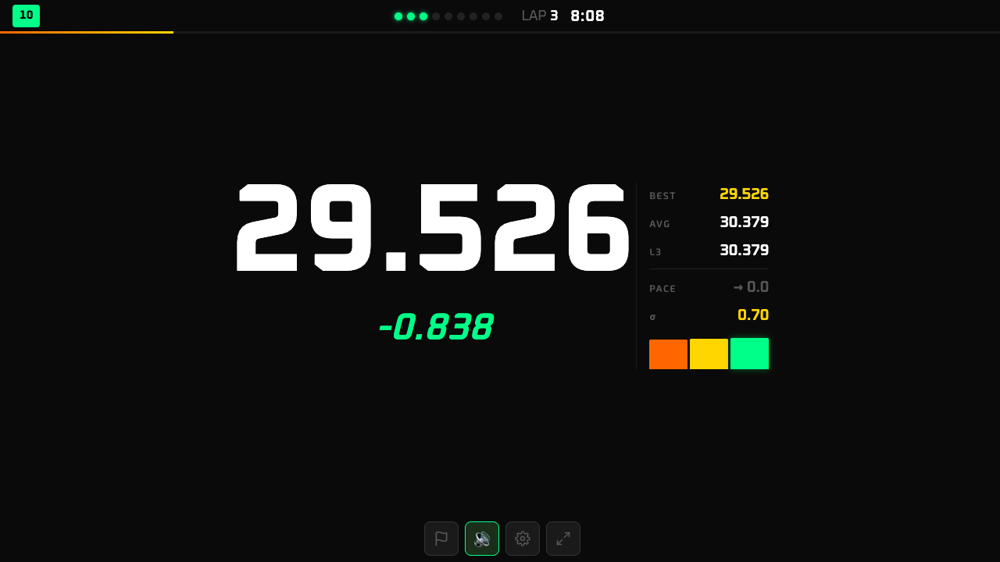
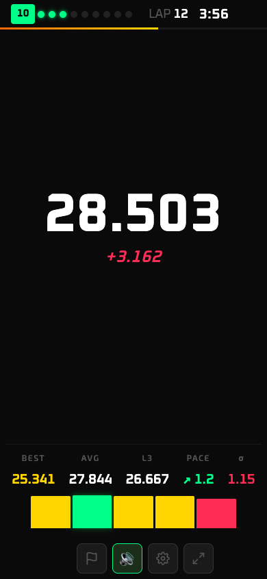
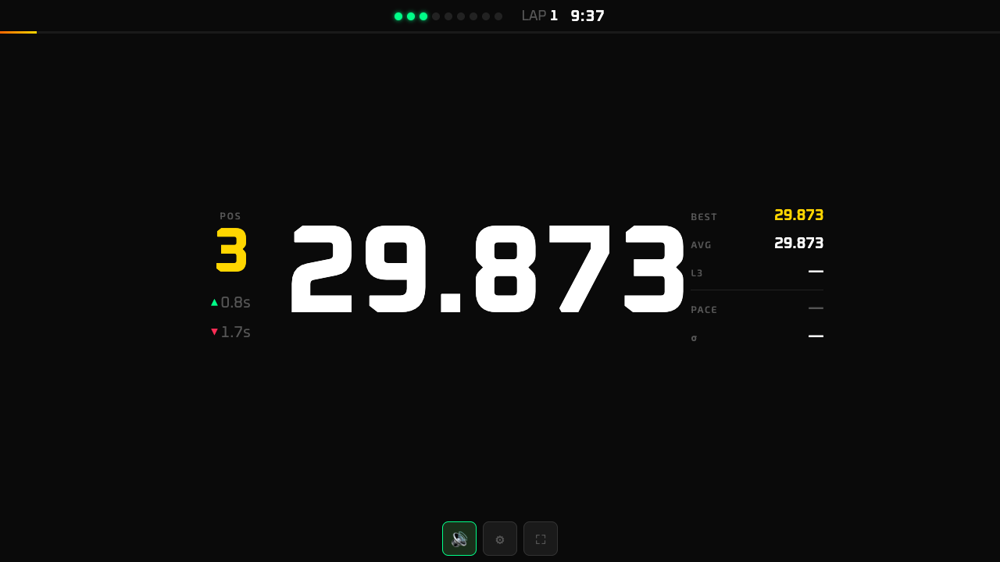
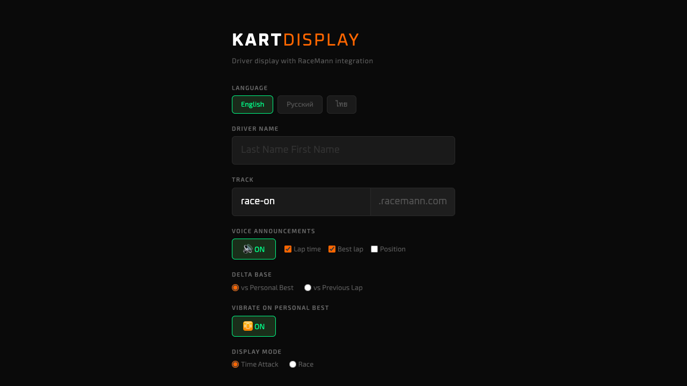
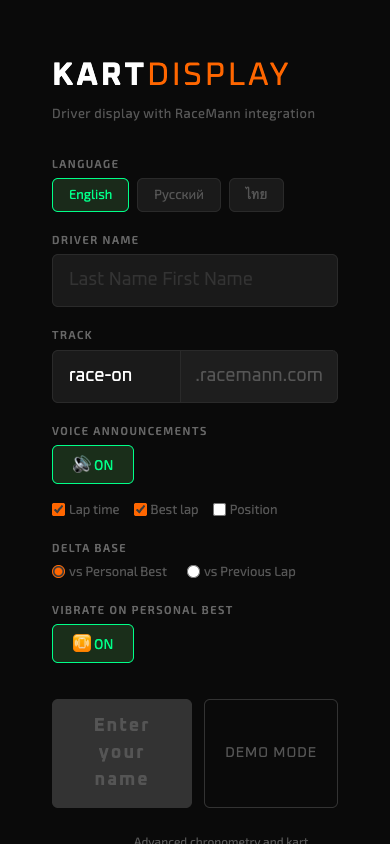

# Kart Driver Display RM

A real-time racing display for go-kart drivers, designed to work with RaceMann chronometry systems.

Shows lap times, position, best lap, gap to leader, and other race data directly on a driver's phone or tablet mounted on the kart steering wheel.

Supports English, Russian, and Thai.

## Display Modes

### Time Attack

Personal performance focus — large lap time with delta, stats panel (best, average, last 3, pace trend, consistency), and a mini lap chart showing the last 5 laps color-coded by quality.

| Landscape | Portrait |
|-----------|----------|
|  |  |

### Race

Competitive mode — lap time with delta on the left, a live leaderboard in the center showing 5 drivers around your position, and stats on the right. Positions and gaps update in real time.

| Landscape | Portrait |
|-----------|----------|
|  |  |

### Settings

| Landscape | Portrait |
|-----------|----------|
|  |  |

## Features

- Auto-detect kart by driver name (no manual kart selection)
- Voice announcements (lap time, best lap, position)
- Flag overlays from RaceMann race control (yellow, blue, red, finish)
- Haptic feedback on personal best
- Wake Lock (screen stays on)
- Installable as PWA

## Development

### Static File Versioning

JS and CSS files use version suffixes for cache busting: `app.v11.js`, `style.v11.css`. The service worker (`sw.js`) caches these by exact filename.

When making changes:

1. Edit the current versioned files (e.g. `js/app.v11.js`, `css/style.v11.css`)
2. Before committing, bump the version:
   - Copy to new version: `cp js/app.v11.js js/app.v12.js`
   - Delete old: `rm js/app.v11.js css/style.v11.css`
   - Update `index.html` references to the new version
   - Update `sw.js`: change `CACHE` name and `ASSETS` array to match new filenames
3. Commit all changes together

The service worker uses network-first strategy, so fresh deploys work immediately. The versioned filenames ensure browsers don't serve stale cached files.

## License

MIT
